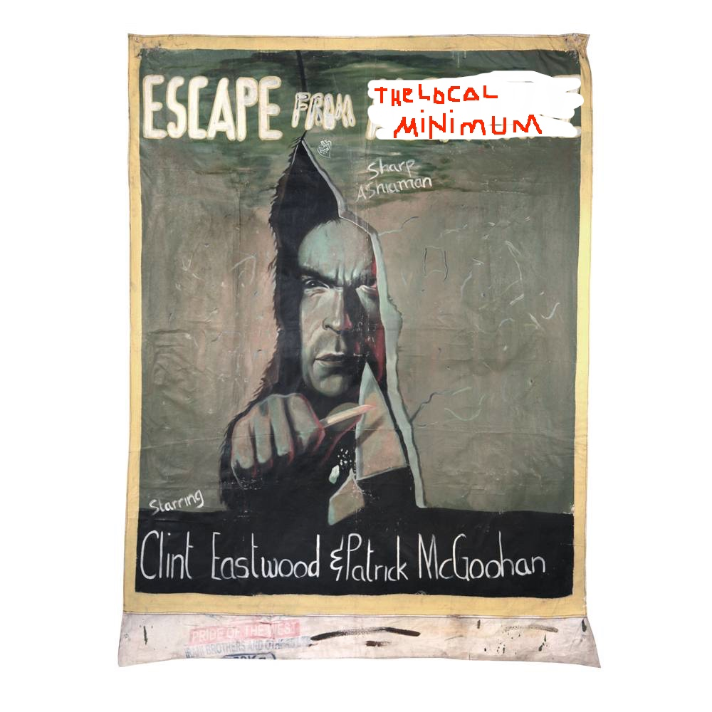

ML tour
=======

Excerpts from [CS156, Neural Networks](https://www.youtube.com/watch?v=Ih5Mr93E-2c).

Past models: perceptron, linear regression, logistic regression.

Arbitrary non-linear twice-differentiable (smooth) function. Next best: convex
function: gradient descent. Go along the negative of the gradient in fixed
sized steps (learning rates).

More general version: stochastic gradient descent.

Intro
-----

Easy to implement. Not model of choice, rather SVM.

SGD
---

GD minimizes an error function (of the weights). Also in-sample error. A
measure between the targets the hypothesis yields and the real targets,
somehow averaged.

The hypothesis needs to be evaluated at *every* point in the sample, because
we want an average error.

GD = batch GD.

SGD uses just one example at the time.

* pick one example (randomly) at a time
* apply GD on that point (remember perceptron learning algorithm)
* think about average direction you decent along, expected value is the same as in batch version

Much cheaper. Randomization (which can be advantageous).

Cases where randomization helps:

* in NN you have lots of hills and valleys in the error surface
* ESCAPE from the local minimum

Neural network model
--------------------

TODO.

Backpropagation
---------------

TODO.

Implementation
==============

* Various minimal variants
* Keras, http://machinelearningmastery.com/tutorial-first-neural-network-python-keras/
* Tensorflow
* scikit-learn

The activation function
-----------------------

* Sigmoid, Tanh, ReLU
* Pros and cons of different activation functions?
* Softmax

Forward propagation
-------------------

1. Take weights and input plus bias to compute the input to a layer.
2. Apply activation function to input.
3. Repeat

Last layer may be different, e.g. softmax to get probabilities?

We search the right parameters (weights plus bias) to minimize the error on the training data.

Zoo of loss functions
---------------------

* square loss
* hinge loss
* logistic loss
* cross-entropy loss

[Are Loss Functions All the Same?](http://web.mit.edu/lrosasco/www/publications/loss.pdf)

> The main outcome of our analysis is that, for classification, the hinge loss
> appears to be the loss of choice. Other things being equal, the hinge loss
> leads to a convergence rate practically indistinguishable from the logistic
> loss rate and much better than the square loss rate.

Usually loss plus regularization (prevent parameters from getting *too big*).

More: http://www.ics.uci.edu/~dramanan/teaching/ics273a_winter08/lectures/lecture14.pdf

Minimizing the error
--------------------

Gradient descent and variants.

Input: Vector of derivatives of the loss function with respect to parameters (weights, biases).

Use backpropagation, so find this vector of derivatives.

Aka: credit assignment problem.

MLP from sklearn
================

* http://scikit-learn.org/stable/modules/neural_networks_supervised.html

Presentation
============

* ML problem
* supervised, unsupervised
* search for a model
* e.g. given an architecture, find the right parameters
* classification, separable data
* perceptron example, gif!, python example
* logical functions, images
* example AND, OR, NOT (show, than ask if people recognize these functions)
* embedded narrative: mappings of logical functions (PH)
* the problem of XOR

