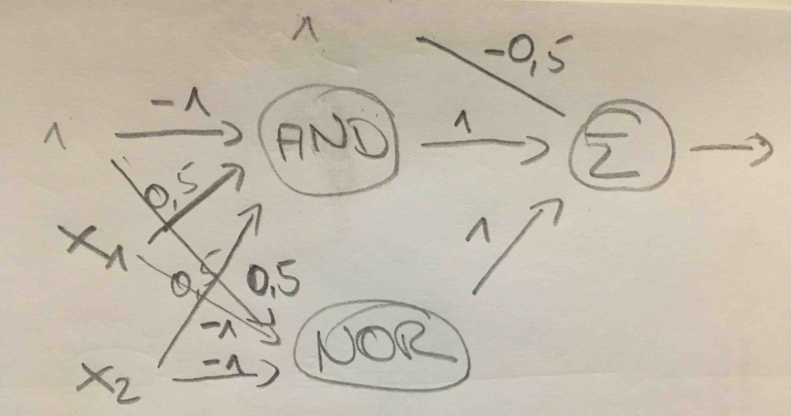

Neuronale Netze - Eine kurze Einführung mit Implementierungen in Python
===
Philipp Hanemann, Martin Czygan

----
The origin - a linear classifier
====


$H_i = <x,w> = \sum\limits_j{x_j w_j} + \theta$


----
Idea of a perceptron as classifier
===

Activation function can vary e.g.: 
- step function 


$$
o_j=
\begin{cases}
1, \text{ if } net_j \geq 0 \\
0, \text{ else}
\end{cases}
$$

---
How to obtain the weights?
===
The objective is a good model fit.
- trial an error $\rightarrow$ inefficient
- optimization $\rightarrow \min\limits_{w}$ Cost($t, w$)
with: 
	$t$: target value
	$w$: weight vector

e.g. squared error as in linear regression
$\Rightarrow$ optimization theory 
- one efficient way for solving the problem is the use of backpropagation (error is "propagated" backwards through the grid)

---

Representing Boolean Algebra as Classifiers
=====
| $x_1$ | $x_2$ | AND | OR | XOR | 
|---|---|-----|----|-----|
| 0 | 0 |  0  | 0  | 0   | 
| 0 | 1 |  0  | 1  | 1   | 
| 1 | 0 |  0  | 1  | 1   | 
| 1 | 1 |  1  | 1  | 0   |

---
AND is linearly seperable 
===
 

---
One possible AND perceptron
===
 

---
OR(/NOR) is linearly seperable
===
 

---
One possible AND perceptron
===
 

---
XOR is not linearly separable
===
 

---
XOR can be represented by a combination of two mappings
===
XOR = NOR (AND, NOR)  
|point| $x_1$ | $x_2$ | $($AND | $NOR$ | NOR $)$ | XOR|
|----|---|---|-----|----|-----|-|
| a  | 0 | 0 		|  0  | 0  | 1   | 0 | 
| b  | 0 | 1 		|  0  | 1  | 0   | 1 |
| c  | 1 | 0 		|  0  | 1  | 0   | 1 |
| d  | 1 | 1 		|  1  | 0  | 0   | 0 |

---
The extra mapping can be visualized
===
 

---
One possible XOR Net (#1)
===
The ones are fixed input (bias) units
 

---
One alternative XOR Net (#2)
===
The number within the perceptron represents the inherent bias unit/or a translational shift when the unit jumps. 
 

---
Two nets with the same result - why care?
===

|	| Net #1 | Net #2 |
|---|----    |----    |
|# weights| 9 | 5 |

- Net #1 has more free variables
- Net #1 has a higher dimensional weight space ($\mathbb{R}^9$ vs. $\mathbb{R}^5$)
- Net #2 has less degrees of freedom and should generalize better.

Why is that? 
- This architecture of the net has a direct effect on the optimization problem and the search space. 


---
The MNIST Dataset for benchmarking
===
 

---
Playing with MNIST and scikit-learn
===
~~~~{.python}
from sklearn.neural_network import MLPClassifier
from sklearn.datasets import fetch_mldata

MNIST = fetch_mldata("MNIST original")
split = 60000  # number of training examples
X, y = MNIST.data / MNIST.data.max(), MNIST.target
X_train, X_test = X[:split], X[split:]
y_train, y_test = y[:split], y[split:]
mlp = MLPClassifier(hidden_layer_sizes=(n_units, n_layers), 
	max_iter=n_iterations, alpha=1e-4, solver=solver, 
        verbose=10, tol=1e-4, random_state=1, 
        learning_rate_init=alpha)
mlp.fit(X_train, y_train)
score = mlp.score(X_test, y_test)
~~~~


---
Evaluating the parameter space
===
cartesian product of:
~~~~{.python}
hidden_units_per_layer = [2, 4, 6, 10, 15]
hidden_layers = [1, 2, 3]
learning_rate = [0.1, 0.2, 0.3]
solver = ['lbgfs', 'sgd', 'adam']
max_iter = [5, 10]
~~~~

$\rightarrow$ 270 runs

~~~(.python)
base_config = {'hidden_units_per_layer': 10.0, 
		'iterations': 10.0, 
        	'hidden_layers': 1.0, 
            	'solver': 'sgd', 
                'learning_rate': 0.1}
~~~
---
Influence of the solver
===


---
Number of hidden units per layer
===


---
Number of hidden layers
===


---
Number of iterations
===


---
Influence of the learning rate
===


----

Roadmap
=======


* Basic: perceptron.py, randomweights.py, pocket.py, xorish.py, basicnn.py
* Data set: mnistimages.py
* scikit-learn: hellosklearn.py, sknngrid.py
* Tensorflow: hellotf.py
* Keras: hellokeras.py

----

perceptron.py
-------------

A simple perceptron plus lots of boilerplate for gif.

* simple update rule
* relatively fast, given the weight space is infinite
* works on separable data

The algorithm is short.

```
misses = misclassfied_points(W)
...
point = random.choice(misses)
W = W + point[1] * point[0]
```

----

randomweights.py
----------------

Gets worse with more dimensions.

----

pocket.py
---------

Like perceptron, but works on non-separable data.

----

xorish.py
---------

The writing was on the wall. Neither pocket, not perceptron will
do too well on such data.

----

basicnn.py
----------

Enter: an activation function.

> The purpose of the activation function is to introduce non-linearity into the network.

> http://stackoverflow.com/q/9782071

